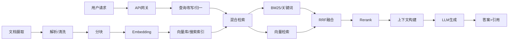
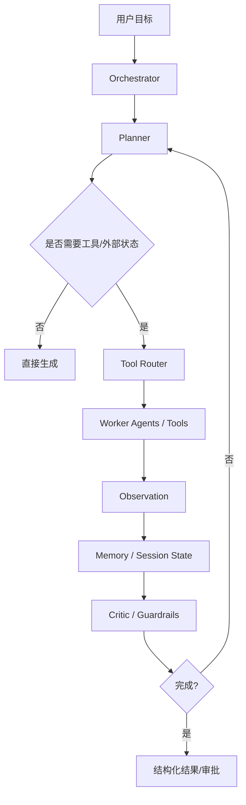
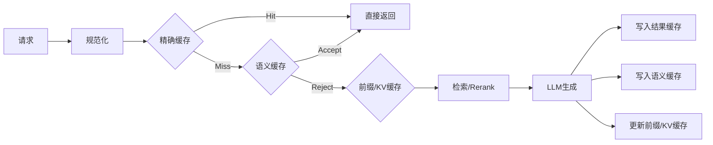

# 面向工程实现的 AI Agent 与缓存系统研究报告

## 执行摘要

在工程实现里，AI 系统的核心不是“某个模型”，而是**检索、编排、缓存、路由、观测、评测**六个系统能力的组合。RAG 侧重点在“把外部知识稳定地喂给模型”，Agent 侧重点在“把推理与工具调用变成可控工作流”，而要把系统真正做快、做稳、做便宜，缓存命中率往往比单纯换模型更有效。官方与研究结果都表明：提示缓存、语义缓存、KV/前缀缓存能显著降低 TTFT、提升吞吐并减少输入成本；但如果阈值、版本键、失效策略和观测做得不好，缓存也会直接放大错误答案与一致性问题。citeturn23search0turn9search1turn36view0turn29search17turn31search1

## 术语总览与工程速查

下表按工程实现把语义高度耦合、通常会联动配置的术语归并成同一条目。每条都给出定义、原理、实现方式、优缺点、关键参数与调优要点，并附上优先级较高的资料来源。

**模型、提示词与生成控制**

| 术语 | 权威定义与原理 | 常见实现、优缺点、关键参数与调优 | 高优先级资料与简评 |
|---|---|---|---|
| **LLM / Foundation Model / Multimodal** | LLM 是以文本为主的基础模型；Foundation Model 还可覆盖图像、音频、视频等多模态输入。多模态模型本质上仍要把输入转成模型可处理的 token/表示，再在统一上下文中建模。citeturn23search0turn15search1 | 选型时先看：上下文窗口、工具调用能力、结构化输出能力、价格、延迟。多模态的优势是减少外部 OCR/解析链条；代价是输入 token 更贵、上下游调试更复杂。citeturn23search0turn15search1turn16search5 | Google 生成式 AI 术语表：定义清晰、中文版可直接引用。citeturn23search0 OpenAI Models 文档：适合做当下模型能力与上下文窗口对照。citeturn15search1 |
| **训练 / 推理 / 微调 / 调优** | 训练是优化模型参数；推理是在固定参数下生成输出；调优/微调是让模型对特定任务更准确。Vertex 文档明确把 full fine-tuning、parameter-efficient tuning、SFT 区分开来。citeturn23search0turn23search8 | 实战上优先顺序通常是：提示词与数据清洗 → RAG → 工具调用/工作流 → 轻量微调；只有当任务稳定、数据充足、评测显示“提示与检索已到瓶颈”时再做微调。优点是风格和任务一致性更好；缺点是持续维护成本高、评测和回滚必须同步建设。citeturn23search0turn3search11turn28search13 | Google 术语表：适合给非研究人员区分 tuning 族概念。citeturn23search0 Vertex AI 术语表：补足“全量/参数高效/SFT”差异。citeturn23search8 |
| **Prompt / System Prompt / User Prompt / Context** | Prompt 是给模型的自然语言或多模态输入；System Message 是最高层行为约束；User Message 承载任务与数据；Context 是本次推理可见的全部上下文。citeturn23search0turn10search17turn10search1 | 工程上要把**稳定规则**放在 system，把**用户变量**放在 user，把**运行时隐藏依赖**放在 local context 或 tool context；避免把认证信息、数据库连接之类塞进模型上下文。优点是职责清晰、利于缓存；缺点是多层提示容易相互覆盖。citeturn10search17turn26search9turn10search1 | Azure system message 设计文档：非常适合工程控制场景。citeturn10search17 OpenAI Prompt Engineering：覆盖 message roles 与结构化提示实践。citeturn10search1 |
| **Context Window / Token** | 上下文窗口是模型一次能处理的 token 数；token 是模型处理的最小离散单位。大窗口提升长文件/长对话能力，但不等于“所有信息都能被同等关注”。citeturn23search0turn16search5turn15search5 | 调优重点不是只追求更大窗口，而是控制“有效上下文密度”：删冗余、摘要、分块、重排。超长上下文的优势是少做外检索；缺点是成本高、回放慢、缓存前缀更容易被截断/打碎。citeturn23search0turn36view0 | Google 术语表（中文版）：定义具体并给了 1M token 的尺度感。citeturn23search0 OpenAI Token 指南：适合解释计费与上下文上限。citeturn16search5 |
| **Temperature / top_p / top_k / max_output_tokens** | 这些都是生成采样控制参数：temperature 控随机性，top_p 是 nucleus sampling，top_k 限制候选词集合，max_output_tokens 控最长输出。citeturn23search0turn16search8 | 事实型任务通常从低 temperature 开始；创意任务再升高。不要同时大幅调 temperature 和 top_p。对工具调用和 JSON 输出，优先低随机性并限制最大输出，避免 tool arg 漂移。citeturn23search0turn16search8turn10search0 | Google 术语表：对参数含义解释得最完整。citeturn23search0 Amazon Bedrock Anthropic 参数说明：清楚给出 top_p/top_k 与“不要同时调多个采样参数”的建议。citeturn16search8 |
| **Hallucination / Grounding / Citation** | 幻觉是“看似合理但错误”的输出；grounding 是把模型输出绑定到可验证来源；citation 则是把证据暴露给上层应用或最终用户。Grounding 是减少幻觉的主要工程手段之一。citeturn15search2turn23search0turn11search20 | 常见实现：RAG、工具查询、规则核验、输出后验证。优点是显著提升可用性；缺点是延迟和系统复杂度变高。关键调优点是：证据粒度、引用格式、回答时是否强制“无依据则拒答”。citeturn23search0turn11search20turn11search12 | OpenAI《Why language models hallucinate》：解释“为什么会幻觉”。citeturn15search2 Google Grounding 术语表：适合工程定义。citeturn23search0 |

**检索、向量与 RAG**

| 术语 | 权威定义与原理 | 常见实现、优缺点、关键参数与调优 | 高优先级资料与简评 |
|---|---|---|---|
| **RAG / Retrieval / Generation / Context Injection** | RAG 是“先检索，再把检索结果注入上下文，再生成”的模式，用训练后获取的外部知识来弥补模型的时效性与私域知识缺口。citeturn23search0turn9search5turn0search0 | 工程上常见三层：查询改写、检索排序、回答生成。优点是更新快、可引用；缺点是把错误面从“模型单点错误”扩展成“解析、分块、向量、召回、重排、拼接”的链式错误。调优先看召回，再看重排，再看生成。citeturn9search1turn32search20turn3search10 | Lewis 等原始 RAG 论文：学术起点。citeturn0search0 Azure 中文 RAG 文档：适合产品级实现路径。citeturn9search1turn9search5 |
| **Embedding / Similarity / Semantic Search** | Embedding 把文本、图像等映射到向量空间；相似对象在向量空间更近；语义搜索据此进行近邻检索。SBERT 和 DPR 都是此路线的重要代表。citeturn23search0turn8search7turn8search2 | 常见相似度：cosine、dot product、L2。优点是能跨表述匹配同义意图；缺点是对精确字符串、代码符号、产品编号不稳定。调优点：嵌入模型、归一化方式、相似度度量、领域数据。citeturn7search0turn7search8turn32search0 | Google 中文术语表：工程定义好用。citeturn23search0 SBERT / DPR：适合理解 dense retrieval 的原理与收益。citeturn8search7turn8search2 |
| **Vector DB / ANN / HNSW / IVF / PQ / Quantization** | 向量数据库负责存储 embedding 并做 ANN 搜索。HNSW 侧重速度与召回；IVF 通过倒排聚类降搜索范围；PQ/量化用空间换精度。citeturn7search4turn8search0turn8search1 | 小规模可直接用 pgvector；中大规模常见 Milvus、Qdrant、Weaviate、Pinecone。HNSW 参数重点是 `m`、`ef_construct`、`hnsw_ef`；IVF 重点是 `nlist`、`nprobe`；PQ 重点是 `m`、`nbits`。HNSW 优势是高召回低延迟，代价是更吃内存；IVF/PQ 更适合大规模低成本。citeturn7search5turn7search2turn9search0turn9search8turn7search1turn7search7 | HNSW 原始论文：最该读的 ANN 论文之一。citeturn8search0 各库官方文档：Milvus/Qdrant/pgvector/Weaviate/Pinecone 都有直接可落地的索引参数说明。citeturn9search0turn7search1turn7search2turn7search7turn7search20 |
| **Chunking / Chunk / Semantic Chunking** | Chunking 是把长文切成更适合 embedding 与检索的小块；语义分块强调按标题、段落、句子等结构做“语义完整切分”。citeturn32search1turn32search4 | 固定长度切块实现最简单，但容易断义；按标题/段落切块更利于召回质量；生产系统常用“结构分块 + overlap + 元数据”。关键参数：chunk size、overlap、是否保留 heading、是否融合父子层级。citeturn32search1turn32search4turn32search20 | Azure Chunking 文档：对 PDF/HTML/RAG 场景最实用。citeturn32search1turn32search4 Anthropic RAG Cookbook：适合快速理解 naïve RAG 的最小闭环。citeturn32search20 |
| **Keyword Search / BM25 / Hybrid Search / RRF** | 关键词检索擅长精确字符串；BM25 是经典稀疏检索排序函数；混合搜索把文本检索与向量检索并行执行，再用 RRF 融合结果。citeturn1search2turn23search1turn23search5 | 对文档问答、代码库、产品目录、报错排障，混合检索通常比纯向量更稳，因为错误码、SKU、函数名往往要靠 BM25 精确命中。优点是鲁棒；代价是链路更长、调参更多。调优重点：BM25 字段权重、向量 top-k、融合前 cutoff。citeturn23search1turn32search0 | Azure 混合搜索中文文档：直接给出 `search + vectors + RRF` 的工程模式。citeturn23search1turn23search5 Elastic BM25 资料：适合理解 sparse 检索的底层逻辑。citeturn1search2 |
| **Top-k / Rerank / Recall / Precision** | top-k 是初次召回条数；rerank 用更强但更贵的模型二次排序；recall 衡量“相关项被找回多少”，precision 衡量“找回项里有多少真相关”。citeturn1search1turn17search0turn17search19 | 实战调参顺序通常是：先把召回做厚（提高 recall），再靠 rerank 做薄（提高 precision）。top-k 过小会漏召回，过大则拖慢 rerank 和生成。对企业知识库，常见做法是“ANN top 20~100 → rerank top 3~10 → prompt”。citeturn1search1turn3search10 | Cohere Rerank：理解跨编码器重排的工程接口。citeturn1search1 Google ML 度量文档：对 precision/recall 的定义最稳妥。citeturn17search0turn17search19 |

**Agent、编排与运行时**

| 术语 | 权威定义与原理 | 常见实现、优缺点、关键参数与调优 | 高优先级资料与简评 |
|---|---|---|---|
| **Agent / Agentic AI / Tool Calling / Function Calling** | AI Agent 是能理解目标、规划步骤、调用工具并完成多步任务的应用。函数/工具调用把模型和外部 API、函数、数据库等连接起来，是 Agent 可行动的基础机制。citeturn23search0turn13search1turn23search0 | 简单任务优先“工作流 + 工具调用”，不要一开始就上完全自治 Agent。Agent 的优点是灵活；缺点是状态膨胀、失败面大、测试更难。关键调优点：工具数量、工具描述质量、参数 schema、失败重试策略。citeturn13search10turn10search0turn20search9 | Google 中文术语表：给出 agent 组成。citeturn23search0 OpenAI Agents SDK：适合工程视角。citeturn13search1 |
| **ReAct / Planning / Reasoning / Action / Observation / Reflection** | ReAct 把推理轨迹和外部行动交织起来：思考、行动、观察、再思考。Reflection 则是在中间或结束阶段回看自己的步骤并纠错。citeturn2search2turn13search10 | 对复杂任务，显式 planner 往往比把所有决策都塞进单轮 prompt 更可控。优点是可解释、可插入人审；缺点是 token 与延迟增加。关键调优：何时规划、何时停止、是否引入 critic/reflection、是否压缩中间状态。citeturn13search10turn26search9 | ReAct 原始论文：Agent 领域里最经典的模式论文之一。citeturn2search2 Anthropic《Building Effective Agents》：更偏工程实践。citeturn13search10 |
| **Workflow / Chain / Pipeline / State Machine** | Workflow 是预定义代码路径；Chain/Pipeline 通常指串行步骤组合；State Machine 将流程建模为状态与转移。LangGraph 明确区分：workflow 是预定路径，agent 是动态过程。AWS Step Functions 也把 workflow 直接定义为 state machine。citeturn34search4turn34search2 | 经验法则：**步骤固定、失败代价高**时用 workflow；**任务开放、依赖外部工具探索**时再用 agent。State machine 的优点是可审计；缺点是复杂分支会快速膨胀。citeturn34search0turn34search2turn34search10 | LangGraph《Workflows and agents》：很适合作为工程分界线。citeturn34search4 AWS Step Functions：最标准的 state machine 教材。citeturn34search2turn34search10 |
| **Memory / Short-term Memory / Long-term Memory / Session** | 短期记忆通常是线程/会话内可见状态；长期记忆跨会话保存用户画像、事实、偏好；session 是把多轮上下文组织起来的运行单元。citeturn13search0turn13search4turn24search8 | 短期记忆要做裁剪/压缩；长期记忆要做命名空间隔离、权限控制与更新策略。优点是个性化和连续性更强；缺点是上下文膨胀、隐私与一致性风险更高。调优看：压缩阈值、召回条件、写入频率、过期策略。citeturn13search5turn24search12 | LangChain/LangGraph Memory 文档：区分短期/长期最清楚。citeturn13search0turn13search4 OpenAI Agents Sessions：适合理解 session memory 的最小实现。citeturn24search8 |
| **Multi-agent / Orchestrator / Worker / Planner / Executor / Critic** | 多 Agent 常采用 orchestrator-worker 模式：主代理分解任务，子代理并行处理不同子问题。Anthropic 公开的多代理研究系统和 Claude multi-agent sessions 都采用类似结构。citeturn13search2turn13search6 | 多 Agent 的优势是并行与专业分工；缺点是 token 放大、协调成本高、调试难。只有当问题天然可并行、专业工具差异明显、单 Agent 已成为瓶颈时才值得上多 Agent。citeturn13search2turn13search10 | Anthropic 多代理研究系统：极好的架构范例。citeturn13search2 Claude Multiagent Sessions：说明了隔离上下文与并行执行的价值。citeturn13search6 |
| **HITL / Approval Flow / Checkpoint / Durable Execution / Rollback / Idempotency / Task Queue** | HITL 指关键动作前要求人工审核；checkpoint 保存中间状态；durable execution 保证进程中断后还能恢复；rollback 把状态回退到先前位置；idempotency 保证重复执行不会造成副作用；task queue 则把待执行任务可靠分发给 worker。citeturn24search1turn24search21turn14search0turn26search3turn17search2 | 对“写文件、发邮件、执行 SQL、调支付”这类副作用操作，必须把审批、幂等键、重试、补偿和队列放在一套运行时里。优点是可靠；缺点是系统更像分布式事务平台。调优重点：重试策略、savepoint 粒度、任务可见性超时、外部 API 幂等键。citeturn14search2turn14search7turn14search11turn24search3 | Temporal 文档：durable execution、task queue 与 idempotency 的首选资料。citeturn14search0turn14search2turn14search11 LangGraph Checkpoints/HITL：适合 Agent 场景。citeturn24search0turn24search1turn24search21 |
| **Tool Registry / Workspace / Sandbox / Access Control / Artifact** | Tool registry 是可供模型调用的工具集合；workspace 是 agent 可读写的工作目录；sandbox 提供隔离执行环境；access control 决定谁可访问什么资源；artifact 是一次工作流运行中产出的文件集合。citeturn26search5turn25search2turn25search6turn25search7turn25search0 | 编码/运维型 Agent 必须默认跑在隔离 sandbox，并把凭证注入、网络策略、读写目录、产物归档做成平台能力，而不是让模型“直接碰宿主机”。优点是风险可控；缺点是实现成本更高。citeturn25search2turn25search6turn25search3 | Docker Sandboxes：适合理解 agent 隔离边界。citeturn25search2turn25search6 OWASP 授权文档 + GitHub Artifacts：补齐权限与产物管理。citeturn25search3turn25search7turn25search0 |

**缓存、性能与平台能力**

| 术语 | 权威定义与原理 | 常见实现、优缺点、关键参数与调优 | 高优先级资料与简评 |
|---|---|---|---|
| **Cache / Cache Hit / Cache Miss / Hit Rate** | 命中表示请求可由缓存满足；未命中则要走原始计算或后端；命中率是缓存成功服务的请求占比。vLLM 对前缀缓存还区分“查询 token 数”和“命中 token 数”。citeturn35search2turn35search3 | 命中率不是越高越好，如果它通过“放宽阈值、返回错误答案”换来，就会伤害系统可靠性。生产里要同时看 hit rate、false-hit rate、eviction 率、saved tokens、TTFT。citeturn35search10turn18search1 | Redis/Cloudflare 对 hit ratio 定义直观。citeturn35search2turn35search0 vLLM 文档：适合理解 LLM 场景下的 token 级命中。citeturn35search3turn18search1 |
| **Prompt Cache** | Prompt cache 复用已处理前缀的 KV 状态。OpenAI 说明其从 1024 token 起自动启用，命中按 128 token 递增，缓存的是重复前缀；Anthropic 说明其缓存“完整前缀”。citeturn5search1turn5search9turn30search1 | 优点：不改模型质量的前提下，直接降低 TTFT 与输入成本；缺点：要求前缀高度稳定。关键调优：把稳定内容放前面、把易变内容放后面、保持工具和 schema 顺序一致、监控 `cached_tokens`。citeturn36view0turn10search0 | OpenAI Prompt Caching 文档与 Cookbook：目前最系统的官方资料。citeturn5search1turn36view0 Anthropic Prompt Caching：补足 TTL 与缓存边界。citeturn30search1 |
| **Semantic Cache / Result Cache / Exact Cache** | exact/result cache 以精确键命中历史结果；semantic cache 不要求 query 文本完全相同，而是在 embedding 空间里找语义相近的历史请求，并返回缓存响应。citeturn4search2turn6search0turn29search1 | exact cache 精度高、风险低；semantic cache 更能吃到“同意图不同表达”的收益，但会引入错答风险。关键参数：embedding 模型、相似度阈值、TTL、租户隔离、知识快照版本。RedisVL 默认 `distance_threshold=0.1`，且允许 exact 与 semantic 同时开启。citeturn6search10turn29search1turn31search0 | RedisVL / LangCache 文档：直接可落地。citeturn6search10turn29search1turn31search2 GPTCache 论文与文档：开源语义缓存代表。citeturn6search4turn6search0 |
| **KV Cache / Prefix Cache** | KV cache 保存 Transformer attention 的 key/value 张量；prefix cache 则在新请求共享旧前缀时复用这些张量，跳过已处理部分的 prefill 计算。citeturn4search3turn36view0 | 它是 LLM serving 的“近乎免费午餐”：不会改变输出语义，却能明显降低前缀重复场景的延迟。缺点是受 GPU 内存、请求路由、前缀稳定性影响大。关键监控：prefix cache hit rate、GPU cache usage、prompt tokens/s。citeturn4search3turn18search1turn35search11 | vLLM Prefix Caching 文档：最直接。citeturn4search3turn5search2 OpenAI Prompt Caching 201：把“前缀缓存为何能省 prefill 计算”讲得最清楚。citeturn36view0 |
| **TTL / Invalidation / Consistency** | TTL 是缓存存活时间；invalidation 是内容过期或数据变更后把缓存废弃；一致性的目标是“不要让缓存比源数据更旧、更错”。citeturn30search0turn30search8turn30search3 | 对 AI 系统，TTL 往往必须和**模型版本、提示词版本、工具 schema 版本、知识库快照版本、租户维度**一起设计。只设 TTL 而不做版本键，极易产生“语义上命中、业务上已过期”的隐患。客户端缓存可利用 key-level invalidation；API 网关可利用 `vary-by` 分区。citeturn30search7turn31search0turn31search3 | Redis TTL/Expire/Invalidation：缓存基本功。citeturn30search0turn30search8turn30search3 Azure APIM Semantic Cache：展示了按订阅维度隔离的做法。citeturn31search0turn31search3 |
| **Cold Start / Warm-up / Preheat** | 冷启动是实例、模型或容器长时间空闲后第一次处理请求的额外启动时延；warm-up/preheat 则是提前加载代码、图、模型权重或路由状态来避免首请求变慢。citeturn33search3turn33search9turn33search19 | 对 LLM 服务，冷启动来自模型权重加载、图捕获、编译与 runtime 初始化。生产里常见手段是：最小热实例、周期预热请求、提前构建常见前缀、在低峰时段预填充缓存。优点是首包稳定；缺点是增加空转成本。citeturn33search0turn33search20turn33search19 | Modal / Google Cloud warm-up 文档：适合理解“花钱换首包”。citeturn33search19turn33search9 vLLM warm-up 指南：更贴近 LLM serving。citeturn33search0 |
| **Latency / TTFT / TTLT / Throughput / QPS / TPS / Rate Limit / Retry / Timeout** | 延迟是用户等待时间，TTFT 是首 token 时间，TTLT 是完整输出结束时间；throughput/QPS/TPS 则衡量单位时间处理能力。Rate limit 限制请求速率；retry/timeout 负责在失败与等待之间找平衡。citeturn23search0turn18search1turn10search3 | 对对话应用，TTFT 比平均延迟更重要；对批处理与离线任务，吞吐更重要。重试必须幂等、带指数退避，并且和 timeout 配对，否则容易自我放大拥塞。citeturn10search7turn10search15turn14search11 | Google 术语表与 vLLM metrics：适合性能指标定义。citeturn23search0turn18search1 OpenAI Rate Limits / Cookbook：工程化处理 429 的首选。citeturn10search3turn10search7turn10search15 |
| **Model Router / Load Balancing / Fallback / Batch Processing / Cost Optimization** | Router 会根据请求特征选择最合适模型；load balancing 在同模型实例间分流；fallback 在主模型失败或成本/速率不满足时切换备用模型；batch 适合离线高吞吐低时效任务。citeturn12search18turn12search5turn12search9turn19search1 | 生产实践通常是：便宜模型兜底常规请求，贵模型承担复杂请求；对超时、429、供应商异常配置分层 fallback；对离线评测、数据生成、批量摘要优先走 batch。优点是降本；缺点是行为差异、评测复杂度和缓存碎片会增加。citeturn12search0turn12search20turn19search1turn4search4 | RouteLLM 论文：解释“为什么路由值得学”。citeturn12search0 LiteLLM Router/Fallback 文档 + OpenAI Batch：直接可部署。citeturn12search5turn12search9turn19search1 |

**可观测性、结构化输出与评测**

| 术语 | 权威定义与原理 | 常见实现、优缺点、关键参数与调优 | 高优先级资料与简评 |
|---|---|---|---|
| **Structured Output / JSON Schema / Guardrails** | Structured Outputs 让模型输出满足给定 JSON Schema；JSON Schema 定义结构与约束；guardrails 则在输入/输出/工具调用两侧做校验与限制。citeturn10search0turn19search3turn11search1 | 对工具调用、数据库写入、审批流、配置生成，一律优先结构化输出。Guardrails 常用于 PII、违规内容、幻觉检测、参数校验。优点是可集成下游系统；缺点是 schema 一变就可能打碎 prompt cache，且过严的 guardrails 会抬高拒答率。citeturn10search0turn11search5turn11search20turn36view0 | OpenAI Structured Outputs：目前最权威的 JSON 输出约束资料。citeturn10search0turn10search4 JSON Schema 官方文档：适合定义复杂结构与维护标准。citeturn19search3turn19search7 |
| **Observability / Trace / Span / Log / Metrics** | OpenTelemetry 把可观测性定义为通过输出理解系统内部状态的能力，核心信号是 trace、metrics、logs。trace 由多个 span 组成；GenAI 语义规范还专门定义了 model spans 和 agent spans。citeturn17search10turn3search13turn11search3turn11search7 | AI 系统至少要记录：模型名、token、成本、缓存命中、工具调用、检索命中、延迟、错误类别、审批中断点。优点是可定位“哪一步坏了”；缺点是埋点不统一时会出现“能看见日志、看不懂全链路”。citeturn3search9turn17search6turn11search23 | OpenTelemetry 文档与 GenAI 语义规范：生产观测的主标准。citeturn3search9turn11search3turn11search7 |
| **Evaluation / Benchmark / Dataset / Labeling / A/B Test** | 评测是用数据集、打分器、对照实验和线上实验系统性衡量 AI 应用。OpenAI 明确提出 agent workflows 需要 traces、graders、datasets、eval runs；RAGAS 则提供 faithfulness、answer relevancy、context recall/precision 等指标。citeturn3search19turn3search14turn3search10 | 建议把评测分成四层：离线样本集、组件级指标、端到端任务成功率、线上 A/B。数据标注既可来自人工，也可来自高质量 grader，但高风险场景仍应引入人审。citeturn28search13turn28search23turn27search1turn27search17 | OpenAI evals 文档 + agent evals：最适合工程闭环。citeturn3search11turn3search19turn28search5turn28search16 RAGAS：RAG 指标体系成熟。citeturn3search14turn3search10 |

## 工程架构模式与流程图

没有单一“最佳架构”。比较稳妥的经验是：**先工作流，后 Agent；先混合检索，后复杂自治；先把评测与观测接上，再谈扩展工具面**。Anthropic 的工程实践明确建议从简单、可组合的模式开始；LangGraph 也明确区分了“固定路径 workflow”和“动态 agent”；Azure 则把产品级 RAG 区分为经典 RAG 与代理检索两条实现路径。citeturn13search10turn34search4turn9search1



这套“经典 RAG”最适合知识问答、客服助手、制度查询、代码库问答。关键不是“把文档扔进向量库”，而是**摄取质量**：解析、去重、结构化分块、元数据、索引参数和混合检索质量决定了后续 70% 以上的问题。Azure 明确把 chunking、vectorization、hybrid search、semantic ranking 作为产品级 RAG 的基本能力；Anthropic 也把“按标题分块 + 向量检索 + 余弦相似度”视为基础 RAG 闭环。citeturn32search1turn32search4turn23search1turn32search20



这套“Agent 系统”适合多步任务、外部操作、跨系统编排。真正做生产时，最重要的不是“让模型更聪明”，而是把**任务边界、工具面、可恢复状态、副作用审批、幂等与回滚**做实。OpenAI Agents SDK 把 agent 定义为“会规划、调用工具、跨 specialist 协作并维护足够状态的应用”；LangGraph 与 Temporal 分别提供了图式编排和 durable execution；Anthropic 的多 Agent 系统则证明 orchestrator-worker 对广度型研究与并行收集特别有效。citeturn13search1turn34search7turn34search9turn13search2

对 AI 后端平台，推荐的公共底座通常包括：统一模型网关与路由、缓存层、检索层、结构化输出层、审计/审批、OpenTelemetry 埋点、评测流水线。这样做的收益是，RAG 与 Agent 不必各自重复实现缓存、观测、路由与 fallback。citeturn12search5turn12search9turn3search9turn3search19

## 最大化 AI Agent 缓存命中率

缓存命中率不是一个孤立指标，而是**上下文工程、路由、索引、版本控制、运行时隔离**共同作用的结果。把缓存做对，往往比“换更大的模型”更便宜、更稳。OpenAI 官方写得很直接：prompt caching 是平台上“杠杆最高”的优化之一；OpenAI 文档与 Cookbook 都给出了最高约 80% 的 TTFT 改善与最高 90% 的输入成本改善；Redis 的语义缓存资料给出的实验收益是 API 调用减少最高 68.8%、延迟改善约 40%–50%；RAGCache 论文则在 RAG 场景里实现了 TTFT 最多 4 倍下降、吞吐最多 2.1 倍提升。citeturn36view0turn4search0turn29search17turn31search1



**缓存分层设计**建议按“风险从低到高、收益从近到远”来排：  
第一层是**精确缓存**，也就是 exact key/result cache；命中条件最严格，风险最低，适合工具结果、模板化问答、固定 system prompt + 固定 schema 的场景。  
第二层是**语义缓存**，对“同意图不同问法”最有效，但一定要带**知识快照版本、租户维度、模型版本、提示版本**，否则会出现“语义相似、业务不一致”的错答。RedisVL/LangCache 直接暴露了 `distance_threshold`、`ttl`、`use_exact_search`、`use_semantic_search` 等参数；Azure API Management 的 LLM semantic cache 直接支持 `score-threshold` 和 `vary-by` 分区。citeturn6search10turn29search1turn31search0turn31search3  
第三层是**prompt/prefix/KV cache**，它不会改变答案语义，只复用模型前缀计算结果，是最“值得先做”的推理级优化。OpenAI 明确说明缓存命中要求**重复的精确前缀**，并且 tools、schemas、ordering 都参与前缀；Anthropic 也明确说明其缓存的是完整前缀。citeturn36view0turn30search1

**要最大化 prompt cache 命中率，首要动作不是调 TTL，而是稳定前缀。**  
OpenAI Cookbook 明确给出一套非常工程化的打法：让稳定内容位于前缀、保持 tools 与 schema 一致、使用 `cached_tokens` 观测、在需要时使用 `prompt_cache_key` 提高“路由黏性”，并避免让时间戳、空格变化、schema key 顺序变化、工具顺序变化破坏前缀。它还给出了两个很有价值的官方经验数据：某编码客户引入 `prompt_cache_key` 后 hit rate 从 60% 提升到 87%；10,000 个相同请求中，Flex + extended prompt caching + `prompt_cache_key` 比 Batch 额外提升 8.5% 命中率，并带来 23% 的输入成本下降。citeturn36view0

**阈值调优是语义缓存成败的分界线。**  
RedisVL 把默认 `distance_threshold` 设为 0.1，并说明这是 cosine distance 量纲；Azure APIM 也明确说“越低的 score-threshold 越严格”，文档示例用了 `0.05`。Redis 官方博客还给出了一条很值得照抄的规则：即便相似度阈值是 0.9，也只对高于 0.92 的请求直接返回，用一个小 buffer 来压低误命中。工程上这意味着：**不要只追求命中率，要优化“可接受命中率”**。citeturn6search10turn31search0turn31search7turn6search6

**向量去重与合并，要分摄取时和查询时两段做。**  
摄取时要先做 exact dedup 和 near-duplicate filtering，Databricks 的 RAG 数据管道把 deduplication 直接放在 chunking 和 embedding 之前；查询时则建议“过召回再去重”，避免同一底层 chunk 占满 top-k。QuOTE 明确提出了 query-time dedup 的必要性；Milvus 文档也展示了基于向量的去重系统。对实际工程，这意味着可以采用三步：**内容哈希去重 → embedding 聚类近重 → 检索后 distinct chunk 选择**。citeturn32search7turn32search17turn32search2

**TTL 与失效策略不要孤立设置，而要做双轨制：时间失效 + 版本失效。**  
时间失效用来兜底陈旧数据，版本失效用来响应真实变更。推荐缓存键至少包含：`tenant_id`、`model_id`、`system_prompt_version`、`tool_schema_version`、`knowledge_snapshot_id`、`output_schema_version`、`locale`。如果任何一项变化，直接视为新键；TTL 只负责最终清理和热点回收。这样做能避免“明明文档更新了，但因为 query 相似而命中了旧答案”。Redis 的 invalidation/TTL 文档、Azure APIM 的 `vary-by` 示例和 OpenAI/Anthropic 的 retention 说明都支持这种思路。citeturn30search3turn30search7turn31search0turn30search6turn30search1

**冷启动与预热要和缓存策略绑在一起看。**  
预热不仅是“把实例拉起来”，还包括“把高频前缀、工具 schema、会话模板、热门知识段”预先走一遍，让 prompt/prefix cache 提前热起来。对长生命周期 Agent，至少保留一部分热实例；对代码 Agent、办公助手、客服助理等高度重复前缀场景，预热收益通常很高。Google 的 warm-up 文档、Modal 的 warm replica 说明和 vLLM 的 warm-up 指南都支持这一点。citeturn33search9turn33search19turn33search0

**推荐监控指标**不应只看单一 hit rate，而应至少包含以下几类：  
一类是缓存效果：exact hit rate、semantic hit rate、accepted semantic hit rate、saved input tokens、saved requests。  
一类是性能效果：TTFT、TTLT、prompt tokens/s、generation tokens/s、p95/p99 latency、GPU cache usage。vLLM 已经把这些指标暴露进 `/metrics`，包括 prompt tokens/s、generation tokens/s、prefix cache hit rate。citeturn18search1turn18search9turn35search11  
一类是质量风险：false-hit rate、stale-hit rate、cache-induced error rate、人工复核拒绝率。  
一类是容量与稳定性：eviction rate、memory footprint、hot key distribution、per-tenant skew。Redis 文档指出低命中率加高淘汰可能说明缓存太小而发生 thrashing。citeturn35search10

**可复现实验设计**建议如下：  
先从最近 2–4 周的真实请求日志中抽取 5,000–50,000 条请求，按租户、语言、任务类型、是否工具调用进行分层采样，并做好脱敏。然后固定模型版本、工具集版本、知识快照版本，构造四个实验臂：无缓存、仅 exact cache、exact+semantic cache、exact+semantic+prompt_cache_key/预热。离线回放时记录 `cached_tokens`、TTFT、TTLT、总 token、最终答案、引用文档 ID、人工或 grader 判定。Primary metric 不是 hit rate，而是一个加权目标：  
`目标值 = 成本节省 + 延迟节省 - λ × 误命中损失`  
随后在 3–5 个阈值上做网格搜索；线上再按 session 级随机分桶做 A/B，并保留 5%–10% 的“永不使用语义缓存”shadow traffic 做持续校验。这与 Microsoft 的在线对照实验经验、OpenAI 的 evals/agent evals 方法和 RAGAS 的组件级评测思路是一致的。citeturn27search1turn27search17turn3search11turn3search19turn3search10

下面这段伪代码概括了推荐实现：

```python
def answer(req):
    norm_q = normalize(req.query)
    version = {
        "tenant": req.tenant_id,
        "model": MODEL_ID,
        "spv": SYSTEM_PROMPT_VERSION,
        "tsv": TOOL_SCHEMA_VERSION,
        "ksv": KNOWLEDGE_SNAPSHOT_VERSION,
        "osv": OUTPUT_SCHEMA_VERSION,
        "lang": req.locale,
    }

    exact_key = hash_json({"q": norm_q, **version})
    if exact_cache.has(exact_key):
        return exact_cache.get(exact_key)

    q_vec = embed(norm_q)
    hit = semantic_cache.search(
        vector=q_vec,
        filter=version,
        threshold=SEM_THRESHOLD,
        confidence_buffer=BUFFER,
    )
    if hit and hit.is_accepted():
        return hit.response

    docs = hybrid_retrieve(norm_q, top_k=RETRIEVE_K)
    docs = dedup_then_rerank(docs, top_k=RERANK_K)
    prompt = build_prompt(system_prompt, tools, docs, req)
    resp = llm.generate(prompt, prompt_cache_key=req.cache_bucket)

    exact_cache.set(exact_key, resp, ttl=TTL_EXACT)
    semantic_cache.upsert(q_vec, resp, metadata=version, ttl=TTL_SEMANTIC)
    return resp
```

## 可执行落地建议与分档方案

下面给出一个按优先级排序、以 ROI 为导向的建议清单。若你现在没有任何特定规模约束，最值得先做的是 **P0：稳定前缀、做 exact cache、接全链路观测、补离线评测集**；它们通常比“换更强模型”更快见效。citeturn36view0turn3search11turn3search19turn3search9

| 优先级 | 建议 | 预估收益 | 复杂度 | 实施步骤 |
|---|---|---|---|---|
| **P0** | **稳定 prompt 前缀** | 直接提升 prompt/KV cache 命中，降低 TTFT 与输入成本 | 低 | 把 system、tools、schema 固定在前缀；把用户变量、时间戳、检索内容放后缀；保证工具与 schema 排序稳定。citeturn36view0turn30search1 |
| **P0** | **先做 exact cache，再做 semantic cache** | 风险最低、见效快 | 低 | 先缓存工具结果、热点问答、固定模板输出；键内加入版本信息；确认命中与失效日志齐全后，再上 semantic cache。citeturn29search1turn6search0 |
| **P0** | **接 OpenTelemetry + 请求级缓存指标** | 快速定位“慢在哪、错在哪” | 中 | 对每次请求记录 model、tokens、cached_tokens、docs、tools、latency、error type；输出到统一 trace/metrics/logs 平台。citeturn3search9turn11search3 |
| **P0** | **建立最小评测集** | 防止“命中率升了，答案变差” | 中 | 收集真实请求 200–1000 条作为黄金集；为 RAG 记录引用文档；引入 faithfulness、answer relevancy、context precision/recall 指标。citeturn3search10turn28search13 |
| **P1** | **混合检索 + rerank** | 通常比“只堆向量库”更稳 | 中 | BM25 与向量并行，RRF 融合后做 rerank；错误码、SKU、函数名场景尤为重要。citeturn23search1turn1search1turn32search0 |
| **P1** | **语义缓存严格阈值起步** | 在收益与错答间找到平衡 | 中 | 用离线日志画阈值曲线；先从严格阈值起步；为边界样本设置 shadow 模式和人工抽检。citeturn31search7turn6search6 |
| **P1** | **把副作用操作放入 durable workflow** | 极大提升可靠性 | 高 | 写文件、发邮件、执行 SQL、下单等必须走 checkpoint、approval、queue、idempotency key。citeturn24search21turn14search2turn14search11 |
| **P2** | **模型路由与 fallback** | 降本增稳 | 中 | 为复杂请求路由到强模型，为常规请求走便宜模型；对 429/timeout/provider outage 做分层 fallback。citeturn12search0turn12search5turn12search9 |
| **P2** | **多 Agent 只在“天然可并行”时启用** | 解决宽任务或多专业协作 | 高 | 先验证单 Agent/workflow 是否已到瓶颈；只有需要并行搜集、多专业工具面、长任务拆解时再上 orchestrator-worker。citeturn13search2turn13search10 |

在开源工具选择上，比较稳妥的组合通常是：**向量检索**用 pgvector / Qdrant / Milvus / Weaviate / Pinecone 之一；**语义缓存**用 Redis LangCache / RedisVL / GPTCache；**编排**用 LangGraph，若有强恢复与可靠执行诉求则上 Temporal；**模型网关与路由**用 LiteLLM；**观测**用 OpenTelemetry；**评测**用 OpenAI Evals、RAGAS、DeepEval。citeturn7search2turn7search13turn23search14turn7search7turn7search20turn31search2turn6search0turn34search7turn14search12turn12search5turn3search9turn3search11turn3search14turn11search6

在“无特定规模约束”的前提下，可以采用下面三档方案。下表的成本为**经验粗估**，不是厂商报价，且**不含模型 token 成本**：

| 档位 | 推荐架构 | 典型组件 | 复杂度 | 粗略成本估算 |
|---|---|---|---|---|
| **小规模** | 单机或 1–2 实例 API + 托管模型 + `exact cache + 混合检索` | FastAPI/Node、Redis、pgvector 或小型 Qdrant、LiteLLM、OTel | 低到中 | 约 **¥1k–5k/月**；1–2 人、1–3 周可出可用版 |
| **中等规模** | 多实例 API + 独立 Redis + 专用向量库 + LangGraph/工作流 | Redis、Qdrant/Milvus/Weaviate、LiteLLM Router、LangGraph、RAGAS、OTel | 中 | 约 **¥5k–30k/月**；2–4 人、1–2 个月做成产品级 |
| **大规模** | 高可用网关 + 分层缓存 + 独立推理/检索集群 + Durable Execution | Redis 集群、Milvus/Qdrant 集群、Temporal、LiteLLM、OTel、A/B 平台 | 高 | **¥30k+/月** 起；4 人以上、持续工程化建设 |

如果需要一个**最小可交付版本**，建议按如下顺序推进：  
第一周做数据摄取、chunking、embedding、混合检索、exact cache；第二周接 `cached_tokens`、OTel trace、离线评测集；第三周再上 semantic cache 和阈值调优；最后才考虑路由、多 Agent 或 durable execution。这个顺序最符合“用最低复杂度换最高确定性收益”的原则。citeturn32search1turn23search1turn36view0turn3search11

## 对比表与参考资料

**缓存策略对比**

| 策略 | 命中条件 | 适用对象 | 优点 | 主要风险 | 推荐做法 |
|---|---|---|---|---|---|
| **Exact Cache / Result Cache** | 键完全一致 | 工具结果、固定模板问答、热点查询 | 简单、准、便宜 | 覆盖面有限 | 先做这一层，再上更复杂缓存。citeturn29search1turn29search0 |
| **Semantic Cache** | query embedding 足够相近 | 高重复意图问答、FAQ、客服、知识问答 | 能吃到“同义复述”收益 | 误命中、跨版本脏读 | 一定加版本键、租户隔离和人工抽检。citeturn6search10turn31search7turn6search6 |
| **Prompt Cache** | 精确重复前缀 | 长 system prompt、多工具 schema、长上下文会话 | 不改质量、直接降 TTFT/成本 | 前缀稍变就失效 | 固定前缀内容、统一工具/Schema 顺序。citeturn5search1turn36view0 |
| **KV / Prefix Cache** | 新请求与旧请求共享 token 前缀 | 自托管推理、长上下文、多轮对话 | 对推理性能提升非常直接 | 受 GPU 内存、路由、热点分布影响 | 监控 prefix cache hit rate 与 GPU cache usage。citeturn4search3turn18search1 |

**向量数据库选型对比**

| 方案 | 更适合什么场景 | 优势 | 局限 |
|---|---|---|---|
| **pgvector** | 现有业务已经深绑定 Postgres；数据量中小；需要事务与 SQL 一体化 | 上手快、运维心智低、和业务表强集成 | 到高规模时索引与检索性能优化空间有限。citeturn7search2 |
| **Qdrant** | 中大型语义搜索、需要 HNSW 与量化、偏工程可控 | HNSW/Quantization 文档好，过滤与优化能力强 | 需要单独运维或托管采购。citeturn7search1turn7search5turn7search13 |
| **Milvus** | 大规模高维向量、对索引类型与性能调优要求高 | 索引种类多，中文文档完善，适合规模化 | 参数较多，调优门槛高。citeturn9search0turn9search8turn23search14 |
| **Weaviate** | 希望内置更多向量索引与生态能力 | HNSW/Flat/Dynamic/HFresh 多样，面向 AI 应用 | 也需要接受其数据与生态范式。citeturn7search7turn7search15 |
| **Pinecone** | 希望尽量少管索引与基础设施 | 全托管、索引自动化、生产接入快 | 成本与平台绑定通常更高。citeturn7search12turn7search20 |

**核心监控指标对比**

| 指标 | 代表什么 | 何时重点看 |
|---|---|---|
| **cached_tokens / prompt cache hit** | Provider 级提示缓存收益 | 使用长 system prompt、多工具、多轮对话时。citeturn36view0turn29search18 |
| **prefix cache hit rate** | 自托管前缀/KV 复用程度 | vLLM/SGLang/TGI 等自托管推理。citeturn18search1turn35search3 |
| **TTFT / TTLT** | 首包体验与完整响应时间 | 交互式对话、客服、代码助理。citeturn23search0turn36view0 |
| **context recall / context precision / faithfulness** | RAG 检索与回答质量 | 调 chunking、top-k、rerank 时。citeturn3search10 |
| **tool success rate / approval interrupt rate** | Agent 工具稳定性与人工介入程度 | 自动执行/副作用任务。citeturn24search1turn13search1 |
| **eviction / cache footprint / stale-hit rate** | 缓存容量与一致性健康度 | 上 semantic cache、多租户缓存时。citeturn35search10turn30search3 |

**参考资料链接与优先级**

**优先级最高的官方资料与原始论文**

- Google Cloud《生成式 AI 术语表》：中文、定义系统、覆盖 AI agent、RAG、embedding、token、grounding、latency、prompt engineering 等核心术语。citeturn23search0  
- Azure 中文《在 Azure AI 搜索中进行 RAG》：把经典 RAG 和代理检索分开讲，适合工程落地。citeturn9search1  
- Azure 中文《混合搜索概述》与《创建混合查询》：产品级 hybrid search + RRF 的直接实现指南。citeturn23search1turn23search5  
- OpenAI《Prompt Caching》与《Prompt Caching 201》：目前关于提示缓存机制、指标、优化动作最完整的官方材料。citeturn5search1turn36view0  
- Anthropic《Prompt caching》：补足前缀缓存语义、5 分钟默认 TTL 与 1 小时选项。citeturn30search1  
- RedisVL《Semantic Caching for LLMs》与 LangCache 文档：直接面向工程实现，解释阈值、TTL、exact/semantic 双模式。citeturn6search10turn29search1turn31search2  
- vLLM《Automatic Prefix Caching》与 Metrics 文档：自托管 KV/prefix cache 的首选资料。citeturn4search3turn18search1turn35search11  
- OpenTelemetry 文档与 GenAI 语义规范：做 AI 可观测性的标准底座。citeturn3search9turn11search3turn11search7  
- OpenAI《Evaluation best practices》与《Evaluate agent workflows》：搭建评测飞轮的官方入口。citeturn3search11turn3search19  
- LangGraph《Workflows and agents》《Graph API》《Persistence/Checkpoints》：区分 workflow 与 agent、理解状态图与 checkpoint 的最好材料。citeturn34search4turn34search0turn24search3turn24search0  
- Temporal《Workflows》《Task Queue》《Retry Policy》《Idempotency and Durable Execution》：把 Agent 副作用从“prompt 逻辑”升级为“可靠系统”的关键资料。citeturn14search0turn14search2turn14search3turn14search11  
- Lewis 等《Retrieval-Augmented Generation》：RAG 原始论文。citeturn0search0  
- Yao 等《ReAct》：Agent 行动-观察-推理模式的起点。citeturn2search2  
- Reimers & Gurevych《Sentence-BERT》、Karpukhin 等《DPR》：理解 embedding 与 dense retrieval 的经典论文。citeturn8search7turn8search2  
- Malkov & Yashunin《HNSW》、Johnson 等《Faiss》：向量索引与高性能相似搜索的基础论文。citeturn8search0turn8search1  
- Bang 等《GPTCache》、Jin 等《RAGCache》：分别对应语义缓存与 RAG 推理缓存的重要研究。citeturn6search4turn31search1  
- RouteLLM：模型路由方向的代表论文。citeturn12search0  

**高价值的官方工程文档与开源项目资料**

- OpenAI Structured Outputs：JSON Schema 约束输出。citeturn10search0  
- JSON Schema 官方文档：结构化输出与工具参数约束的基础。citeturn19search3turn19search7  
- LiteLLM Router / Fallback / Load Balancing：模型网关、分流与降级的可运行方案。citeturn12search5turn12search9turn12search20  
- RAGAS 文档：RAG 组件级评测指标。citeturn3search14turn3search10  
- DeepEval 文档：Agent/RAG/聊天应用的评测框架。citeturn11search6turn11search14  
- Milvus 中文索引文档：HNSW_PQ、IVF_PQ 参数解释清楚。citeturn9search0turn9search8  
- Qdrant 文档：量化、HNSW、过滤与检索优化。citeturn7search1turn7search5turn7search13  
- pgvector README：在 PostgreSQL 内做向量检索的低门槛方案。citeturn7search2  
- Weaviate vector index 文档：多种向量索引类型。citeturn7search7turn7search15  
- Pinecone Docs：托管向量数据库与相似度度量。citeturn7search20turn7search8turn7search0  
- Docker Sandboxes 与 OWASP Authorization：做 Agent 安全边界时很值得参考。citeturn25search2turn25search6turn25search3  

**需要结合业务验证后再采用的补充资料**

- Redis《What is Semantic Caching?》：给出了“API 调用减少 68.8%、延迟改善 40–50%”这类非常有用的运营指标，但仍建议先用自己的日志回放复现。citeturn29search17  
- OpenAI Prompt Caching 201 中的案例数据：例如 `prompt_cache_key` 从 60% 提到 87% 的案例、Flex 对 Batch 的 8.5% 命中率提升，适合作为设计方向，不应直接代替你的业务压测。citeturn36view0  

**局限与开放问题**

本报告优先覆盖了工程上最关键、最常联动配置的术语与模式，并把大量低争议的通用软件词汇做了合并呈现；如果后续你需要把“所有基础与通用词条”再展开成更细粒度的名词辞典，最适合额外细化的是：API/endpoint/model ID、具体审批状态机、更多缓存淘汰算法、更多 embedding/rerank 模型族，以及针对特定行业场景的合规模板。上面的成本估算为工程经验值，不是厂商报价，也不包含模型 token 消耗。